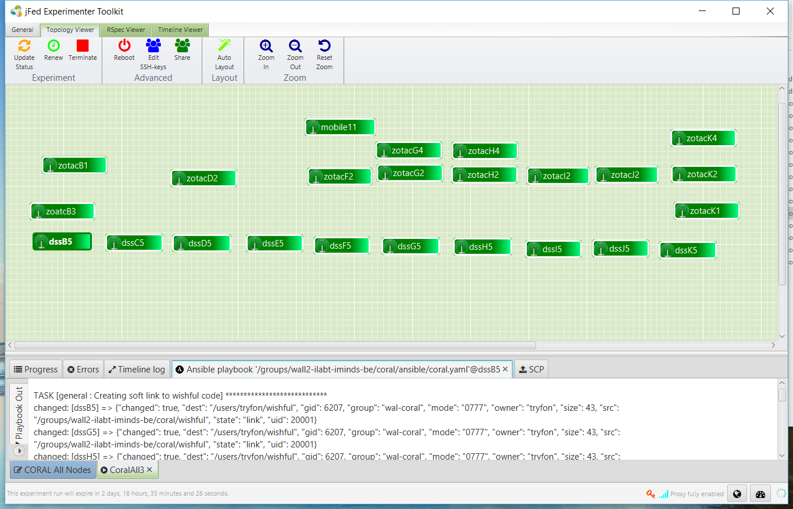
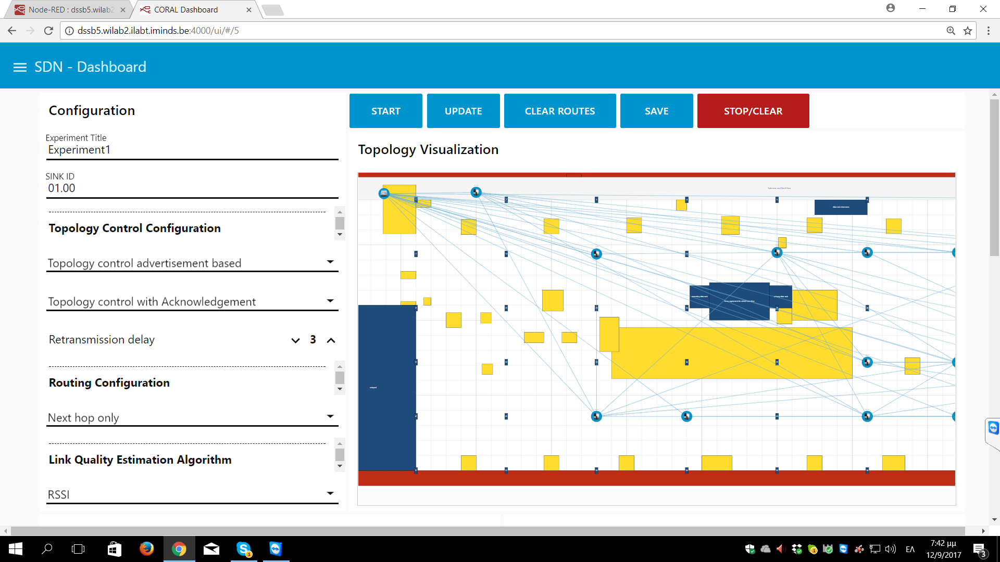
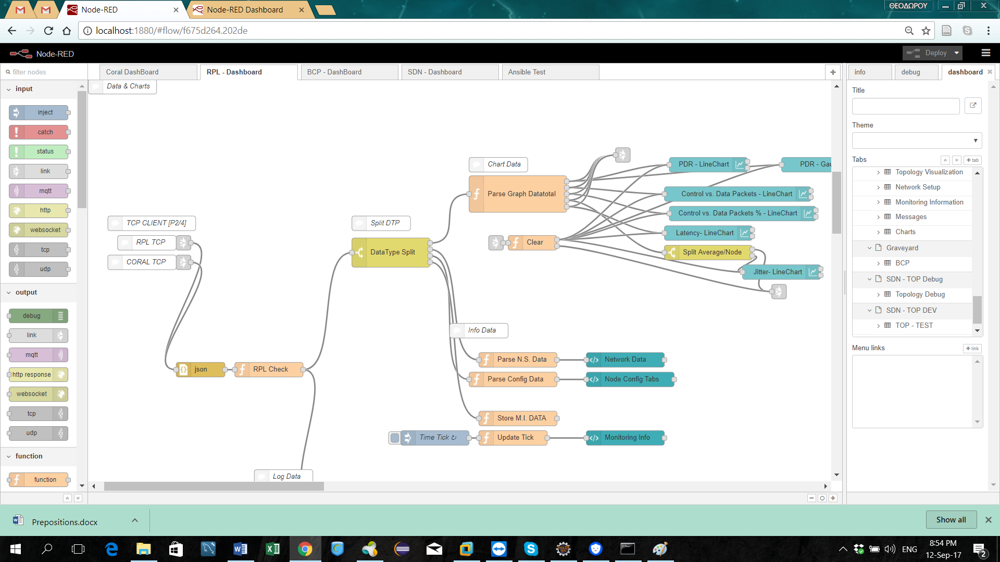
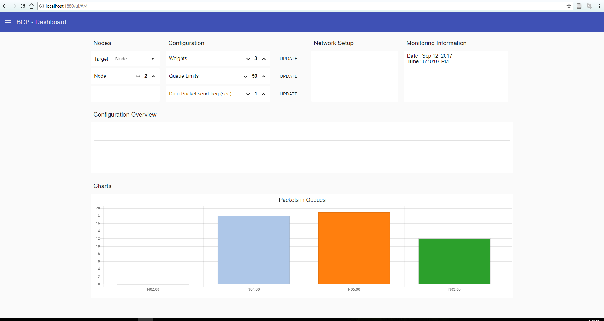
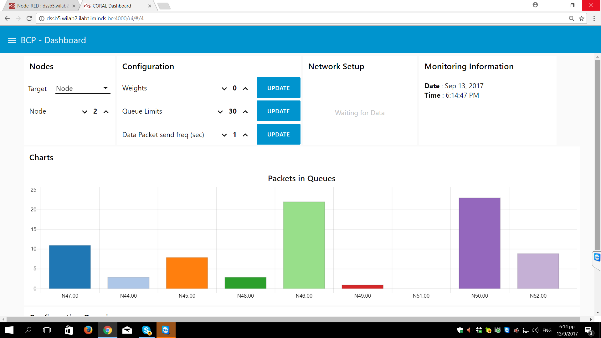

MINOS A Multi-protocol Software Defined Networking Platform for the Internet of Things
======================================================================================

MINOS front end and GUI is under heavy developlent and reconstruction at the moment.
Some pics of previous versions and papers presenting its predecessor (CORAL) are included here and in the wiki.

* [A paper in infocom 2017](https://www.researchgate.net/publication/317179177_An_Experimentation_Facility_Enabling_Flexible_Network_Control_for_the_Internet_of_Things) 
* [CORAL-SDN protocol video](https://www.youtube.com/embed/eOEJwgWmHmU)
* [Adaptable RPL protocol video](https://youtu.be/a8WM_Ql6tMo)

### Real testbed in imec, Ghent, Belgium (WISHFUL Project)

### Realistic Visualization

### Node Red connection to GUI

### Running Backpressure algorithm

