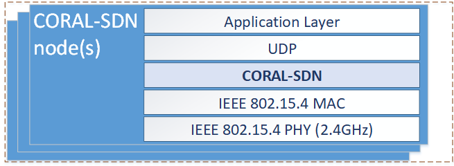

## CORAL-SDN
Recent proposals enhance Wireless Sensor Networks (WSNs) with Software Defined Networking (SDN) practices, introducing new innovative network control strategies and protocols based on a central control logic, i.e., enabling WSNs as crucial facilities for the Internet of Things (IoT). In this direction, we demonstrate CORAL-SDN, an SDN solution for WSNs which: (i) uses intelligent centralized control mechanisms to adjust dynamically the protocol functionalities; (ii) supports elasticity to the challenging requirements of the WSNs; (iii) maintains a scalable architecture; and (iv) exhibits improved network management and operation in terms of performance and resource utilization. With this demo we provide a suitable environment for hands-on experimentation, featuring the CORAL-SDN protocol operation in real test-beds and highlighting the improvements that SDN brings to IoT.

We implemented the CORAL-SDN network stack using the C programming language. It operates inside IoT devices’ firmware, compatible to Contiki-OS 3.0 and consists of the following layers: the IEEE 802.15.4 PHY and MAC layers, offering standardized low-power and lossy wireless communication and media access control in the band of 2.4GHz; the CORAL-SDN forwarding layer, our own protocol in the data plane side, that maintains the forwarding table; the UDP and the Application layers, that sending sensor data measurements in UDP packets.

