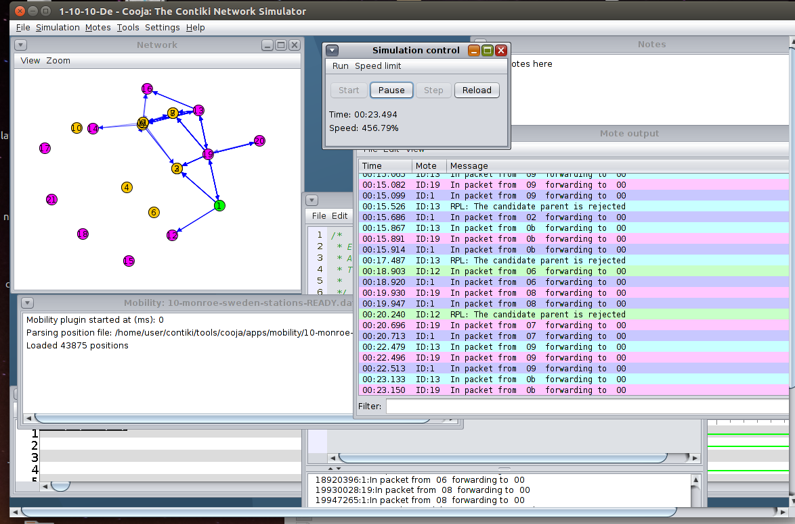

# Adaptable RPL contiki
Abstract: Contiki and code to automatic and unattended running different experiments with cooja. There are 3 basic experiments, one all RPL default, one that starts with default parameters, and can change them during the time of the experiment, and one that starts with parameters altered from the beginning. After the experiments are finished (without need for cooja to run the GUI) there are scripts to create all graphs of Packet Delivery Ratio and Overhead. 
To get a better idea, you should read [this paper](http://swn.uom.gr/storage/app/media/uploaded-files/Routing%20under%20heterogeneity%20and%20mobility%20for%20the%20Internet.pdf), presented in Globecom 2018.


Notice the messages in the motes' output are (much) more detailed than the standard contiki-RPL. They show detailed paths for each UDP packet traversing the network.

## PREREQUISITES:
* #### Install ant: sudo apt-get ant
* #### Make sure you have Java JDK 8 (not jre) as default java. Instructions [here](https://www.digitalocean.com/community/tutorials/how-to-install-java-with-apt-get-on-ubuntu-16-04).
 
## DESCRIPTION
This Contiki version is modified only for specific message outputs in Cooja.
It was tested on a clean machine, Ubuntu 16.0 working fine, but it should run in Ubuntu 14.0 as well. It was not tested in Ubuntu 18.0, but you should have no issues running it. 
All alterations are in the folder core/net/rpl/*.* and they all have the comment ```//George``` at the beginning.
The easiest way to track them all is to open the Terminal, navigate to Contiki folder, and then type ```“grep -r “//George”```.

Experiments were fully automated.
Python code can run all three different scenarios according to the paper presented in Globecom.
Scripts are all in folder Contiki/tools/cooja/scripts_only, and they all need to be copied in the experiment folder.

All *.plt files are automatically creating gnuplot graphs. They are called automatically, or can be hand-picked.

Each experiment can run in multiple times changing AUTOMATICALLY the Idouble and Imin of certain stations.
#### There are 3 basic scenarios:
* Adaptable: The Imin/Idouble will change form the beginning of the simulation
* Default: Standard RPL
* Dynamic: Parameters can change during the experiment (e.g.after 20min, and then back after 40min)

The scenarios are ready to run in cooja (scenario_name.csc). They can run via the script, or you can run them via the Cooja GUI (look at the screenshot).
There are several different mobility traces, all inside the dedicated folder of cooja (cooja/aps/mobility/). You can find also the scripts needed to create your own traces file.

Many different experiments exist in file Contiki/tools/cooja/auto_run/* . In each folder you will find 3 different *csc files, corresponding to 3 different experiments above, and all necessary scripts. Run the file “runTHISscript” and after it finishes you will find many different folders with all log files, all graphs. Familiarize your self with all different files and folders, and then change the parameters (Imin, Idouble, Period. Etc.). Folders iL* contain the log files, if you keep those, you can re-run the scripts on them to recreate graphs and statistics (You obviously need to alter the scripts).

### Cooja run
To run cooja, go to Contiki/tools/cooja, and run “ant run big_mem”.
From cooja go to file-open simulation-open and reconfigure (so you can see what will go wrong if any), and navigate to folder(s) inside /contiki/tools/cooja/auto_run/* and choose any *.csc . 
Cooja is compiling z1 (zolertia) devices with the code found in /Contiki/examples/ipv6/coral-rpl-udp/* . 
#### There are 3 basic categories of nodes:
* Server node (sink): As a static node it is a good idea to keep the Imin low (feel free to experiment)
* Static node: Again, usually small Imin.
* Mobile node: Usually Imin remains unchanged. Be advised: Mobility plugin wants the mobile nodes first! So, create the mobile nodes, e.g., from 1-5, and then the statics from 6-11. Be careful with mobility traces, you SHOULD NOT include node 0, if you don’t want the sink to be a mobile (usually the case).
#### All nodes have 3 versions: 
* De, nothing changes (Default RPL)
* A(daptable) parameters change from the beginning
* Dy(namic) parameters change at given time intervals (e.g. 20min, 40min)
The code to change the parameters is at the bottom of the C code
```
  //change this number to anything. You can use this code twice or more  
  if(counter == 30){ 
       printf("R:%d, Changing Imin from 12 to 8\n",counter);
       d->instance->dio_intmin = 8;		  
		  printf("R:%d, Changing Idouble from 8 to 0\n",counter);
		  d->instance->dio_intdoubl = 0;
    }
```


