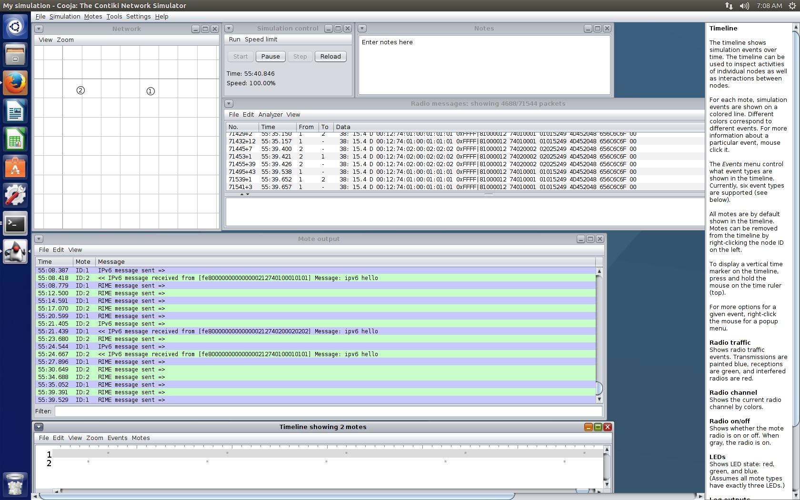

Contiki dual
============================

This is a work in progress and one of our current goals, i.e., to enhance MINOS with the ability to operate "multi-stack" network protocols. In this attempt we have an adapted Contiki environment that supports a network stack with two routing algorithms: 
* RIME 
* IPv6

In the experiment we implement two network nodes that exchange messages using dynamically and interchangeably RIME and IPv6 messages.

### The example requires a LINUX machine with Java and Contiki. 

#### Execution Steps: 
* ```cd minos/protocols_deployment/contiki-dual/tools/cooja```
* ```ant run```
* Search and run the experiment in /tools/cooja/examples/dual-protocol/dualProtocols-RIME-IPv6.csc 

### More information

#### Contiki elfs - Dynamically Loading Linking Libraries to Contiki at run-time
[http://dunkels.com/adam/dunkels06runtime.pdf](classical Dunkels paper)

#### Documentation of ELF
* [https://dak664.github.io/contiki-doxygen/a01562.html](doxygen)
* [http://contiki.sourceforge.net/docs/2.6/a01749.html] (contiki 2.6)
* [https://github.com/contiki-os/contiki/wiki/The-dynamic-loader] (dynamic loader wiki)

#### ELF loading example
* [https://github.com/contiki-os/contiki/blob/master/examples/sky-shell-exec/README.md](sky example)
* [http://courses.cs.tau.ac.il/embedded/contiki-2.3/apps/shell/shell-exec.c](tau course)
* [http://contiki-developers.narkive.com/ZSCNGOq4/the-dynamic-elfloader-problem](elf problem)
* [http://contiki-developers.narkive.com/Fd5kIqrF/problem-with-loading-elfs-in-contiki](contiki elf problem)
* [https://gitlab.ibr.cs.tu-bs.de/cm-thesis/2015-priedigk-ba-secure-wsn-udtn-code/blob/889a2bb0245ecb4168b800abc1c9243e730354b5/examples/sky/tcprudolph0.c](a thesis on the matter)
* [https://sourceforge.net/p/contiki/mailman/message/32335474/] (blink elf example)
* [http://osdir.com/ml/os.contiki.devel/2008-08/msg00034.html] (contiki message board)

#### Sending ELF to an other host
* [https://gitlab.informatik.uni-bremen.de/bergmann/dcaf/commit/a9798651464e0992a687f00424b59865d11ee267](gitlab)
* [https://github.com/contiki-os/contiki/blob/master/apps/codeprop/codeprop.c] (CODE PROPAGATION)

#### Example source code (dload.c - hello.c)
[elf.tar.gz](elf.tar.gz)
make process
* make TARGET=sky clean CLEAN=symbols.?
* make dload.sky
* make CORE=dload.sky dload.sky
* make CORE=dload.sky dload.sky
* make TARGET=sky hello.ce
#### Enable DEBUG info for elf
* core/loader/elfloader.c
* #define DEBUG 1
* #if DEBUG


For more information contact Tryfon at theodorou@uom.edu.gr

For more information about Contiki, see the Contiki website:
[http://contiki-os.org](http://contiki-os.org)
